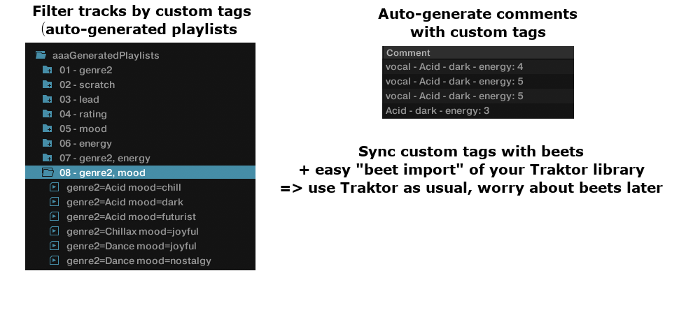

# Traktor custom tags: Beets Integration

This project is an integration between [Beets](https://github.com/beetbox/beets) 
and Traktor that helps manage Traktor libraries.

**Warning:** this was developped and used only on MacOs, I doubt this project is compatible with Windows. 
This project comes with no guarantees: I recommend backing-up your files.



Core features (detailed in [Features](#Features)):
- enable usage of custom tags in Traktor through auto-generated playlists
- auto-generate comments on Traktor tracks to help you visualize custom tags
- sync tags between Traktor and Beets
- utils to easily import your Traktor library into Beets' library
- utils to prompt pre-configured custom tags to easily tag your tracks
- auto-import "m3u" playlists folders in Traktor (useful when using the `smartPlaylists` Beets plugin)

Planned features:
- multi-value metadata support
- create an issue if you have a feature request ;)

Feel free to contribute with PRs/issues ! 

## See it in action !

Created a quick Youtube video in addition to this doc to show the workflow: [here's the link](https://youtu.be/Mryh9AjpmfU).

## Install

This projects was developed `pipenv` + `python 3.8`.

```
git clone https://github.com/16pierre/traktorPlaylistExport
cd traktorPlaylistExport
pipenv install
```

## Configuration
```
cp locations.json.template locations.json
cp scanner_tags.json.template scanner_tags.json
```

1. Edit `locations.json` to specify where your `Traktor` `collection.nml` file is etc.
2. Edit `scanner_tags.json` to specify the different custom tags you want to use & playlists you want to generate
3. For import utils: edit `Beets` config: set `import.link: yes` (see [below](#configuration-required))

## Usage


### Sync Traktor<->Beets
```
pipenv run sync
```

### Utils: tag scanner
Helps you scan your tracks with tags specified in `scanner_tags.json`.
You can also use `beet modify`, but most of the time I find it more convenient to use the scanner to avoid typos.
```
pipenv run scan
pipenv run scan artist:Daft Punk
etc.
```


### Utils: import helper
Helps you import your `Traktor` library inside `Beets`. See below for more explanation, this is not trivial.
```
pipenv run import
```

## Features

### Sync Beets<->Traktor

In this section, let's assume that tracks are imported in both `Beets` and `Traktor`, 
and that they both use the same file paths.

The core idea here is the link between `Traktor`'s playlists and `Beets` metadata. Let's take a few examples.

Say I configured `scanner_tags.json` with:
```
{
    "_playlists": [
        ["mood"],
        ["energy"],
        ["mood", "energy"]
    ],
    "mood": ["dark", "joyful"],
    "energy": ["1", "2", "3", "4", "5"]
} 
```

This will create 3 kinds of playlists in `Traktor`:
- one for each `mood`: `mood: dark`...
- one for each `energy`: `energy: 1`...
- one for each `(mood, energy)` couple: `mood: dark, energy: 1` 

With this system, we can unambiguously link `Beets metadata` to `Traktor playlists`; 
this link is the core mechanism behind the sync:
1. Editing a tag in `Beets` will update the matching `Traktor` playlists
2. Adding a track to a `Traktor` playlist will update the corresponding tags in `Beets`

Extra mechanisms:
- you can use the star rating system in `Traktor`, it's synced with the `rating` tag in `Beets`.
- to help you visualize the metadata in `Traktor`, the sync writes comments on the Track to list the custom tags 
(warning: this will override existing comments, 
will be fixed, issue: https://github.com/16pierre/traktorPlaylistExport/issues/1)


### Help import Traktor library into Beets

#### Configuration required

**Note:** this util requires using `beet import` with symlinks. You therefore need to configure `Beets` like this:
```
import:
    link: yes
``` 
For more details, see [Beets docs](https://beets.readthedocs.io/en/stable/reference/config.html#link).

#### Why add utils for imports
In order for the sync to work properly, you need to have imported the tracks in both `Traktor` and `Beets`.

Importing `Beets`' library in `Traktor` is easy: you can simply setup the `Traktor` 
default music directories to include `Beets`' folder. 

The issue is rather importing `Traktor`'s library in `Beets`:
- if you copy the files to `Beets`, you'd end up with useless duplicates
- if you move the files to `Beets`, you'd need to relocate all the tracks
- running `beet import` is not easy if the files in your `Traktor` library are not centralized

That's why I implemented some utils for this use case.

#### How these utils work

Let's see what happens step by step when running `pipenv run import` 
(this also happens when running `pipenv run sync`):
1. Import whatever you want in `Traktor`, you can also sort your tracks in playlists like explained above: 
this will be tagged later even if your tracks are not imported in `beets` yet
2. _Automatic_: find all tracks imported in `Traktor` but not in `Beets`
3. _Automatic_: symlink these files to a temporary directory organized by album 
4. _Manual action required_: `beet import` in the temporary directory. 
**Warning:** you need to 
[configure](https://beets.readthedocs.io/en/stable/reference/config.html#link) 
`import.link = yes` in `Beets` config 
5. _Manual action required_: **close Traktor if opened**.
6. At this point, we have a double symlink: `beet_library -> temporary folder -> original track`
7. _Automatic_: detects that tracks have been imported in `Beets` thanks to the symlinks.
8. _Automatic_: delete symlinks, move the original files to `beet_library`, 
and update `Traktor` library to point to `beet_library` instead of the original files. 
9. You can reopen Traktor now :)
 

